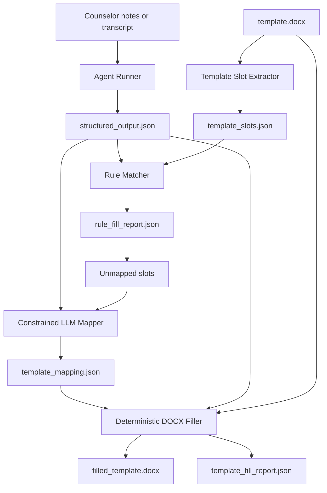

# Model-Assisted Template Mapping Design

Date: 2026-06-09

## Recommendation

Use a constrained hybrid pipeline:

1. Convert counselor notes, dictation, or raw session material into W1/W2/W3 `structured_output.json`.
2. Extract fillable slots from the uploaded `.docx` template.
3. Fill high-confidence rule matches deterministically.
4. Ask the model only to map remaining template slots to existing structured JSON paths.
5. Fill the Word document deterministically from the approved mapping.
6. Write an audit report for every filled, skipped, and unmapped slot.

This is safer than asking the model to directly write into the Word template from oral notes. The model should not invent template content. It should choose from known source paths or explicitly return `unmapped`.

## Why This Route

### Most stable

W1/W2/W3 already define the product's core information structure. Using them as the intermediate layer keeps template filling independent from the original input style: typed notes, pasted records, transcript text, or later speech-to-text can all become structured JSON first.

### Lowest hallucination risk

The model is not allowed to create arbitrary final text for the document. It can only:

- select a `source_path` from structured JSON,
- explain why that path fits the template label,
- return `unmapped` when no safe match exists.

### Easier to evaluate

Mapping can be scored separately:

- Did the model map the slot to the correct `source_path`?
- Did it leave truly unknown fields unmapped?
- Did it avoid putting risk, diagnosis, or privacy-sensitive content into inappropriate slots?

## Rejected Alternatives

### Alternative A: Direct oral notes to Word template

Flow:

```text
counselor dictation -> model -> filled Word
```

Reason rejected for v0.1:

- highest hallucination risk,
- hard to trace where each filled value came from,
- fragile when templates vary,
- difficult to evaluate,
- harder to enforce privacy and clinical boundary rules.

### Alternative B: Model reads template and writes final field text

Flow:

```text
structured_output.json + template -> model-generated field values -> Word
```

Reason rejected for first implementation:

- better than direct oral notes, but still gives the model too much freedom,
- may paraphrase or over-interpret sensitive clinical content,
- field-by-field provenance is weaker.

### Recommended C: Model maps fields, code fills fields

Flow:

```text
raw notes/transcript -> W1/W2/W3 structured JSON
template.docx -> extracted template slots
structured JSON + template slots -> model mapping JSON
mapping JSON + structured JSON + template.docx -> deterministic filler
```

This is the recommended path.

## Architecture



## Components

### Template Slot Extractor

Reads `word/document.xml` and outputs all likely fillable slots:

```json
{
  "template_file": "template.docx",
  "slots": [
    {
      "slot_id": "paragraph[8]",
      "label": "下次咨询重点",
      "location": "paragraph[8]",
      "slot_type": "paragraph_placeholder",
      "current_text": "下次咨询重点：____"
    },
    {
      "slot_id": "table[0].row[2].cell[1]",
      "label": "风险变化",
      "location": "table[0].row[2].cell[1]",
      "slot_type": "table_adjacent_cell",
      "current_text": "____"
    }
  ]
}
```

### Rule Matcher

Uses the existing deterministic alias rules first. High-confidence matches should not call the model.

### Constrained LLM Mapper

Receives only:

- detected slots,
- available source paths and values from `structured_output.json`,
- mapping rules,
- safety instructions.

It must return JSON only:

```json
{
  "mappings": [
    {
      "slot_id": "paragraph[8]",
      "template_label": "下次咨询重点",
      "source_path": "next_session_focus",
      "confidence": "medium",
      "reason": "The label asks for next-session focus and the source path contains the structured follow-up plan."
    },
    {
      "slot_id": "table[1].row[4].cell[1]",
      "template_label": "诊断",
      "source_path": "unmapped",
      "confidence": "none",
      "reason": "The structured output does not provide a diagnosis, and the agent should not infer one."
    }
  ]
}
```

Validation rules:

- `source_path` must be one of the provided source paths or `unmapped`.
- `confidence` must be `high`, `medium`, `low`, or `none`.
- `low` and `none` mappings are not filled automatically.
- final fill still happens in code, not by the model.

### Deterministic DOCX Filler

Extends the existing `scripts/fill_docx_template.py` behavior:

- accepts optional `template_mapping.json`,
- fills only mapped slots whose source path exists,
- never overwrites non-placeholder text,
- writes a full audit report.

## Data Flow

### Typed or pasted counselor notes

```text
notes -> run-agent -Workflow W2/W3 -Structured -> structured_output.json -> template mapping -> filled_template.docx
```

### Counselor oral dictation later

```text
audio -> speech-to-text transcript -> run-agent -Workflow W2/W3 -Structured -> structured_output.json -> template mapping -> filled_template.docx
```

Speech-to-text is a separate upstream capability. It should not change template filling rules.

## Safety Boundaries

The model-assisted mapper must not:

- create clinical diagnoses,
- infer risk level if not present in structured output,
- invent missing personal information,
- place sensitive information into unrelated template slots,
- fill fields marked `unmapped`, `low`, or `none`,
- bypass the final report.

The report should always preserve:

- template slot label,
- selected source path,
- confidence,
- fill status,
- reason for skipped or unmapped fields.

## Evaluation Plan

Create eval cases for:

- exact label match: `风险变化` -> `risk_change.content`.
- synonym match: `后续计划` -> `next_session_focus`.
- ambiguous field: `咨询目标` -> `unmapped` unless W1/W2/W3 contains a safe source.
- unsafe field: `诊断` -> `unmapped`.
- privacy-sensitive field: `身份证号` -> `unmapped` unless the source explicitly contains it and workflow allows it.
- no overwrite: populated template cell should remain unchanged.

Passing criteria:

- correct source path for clear fields,
- no fill for unsafe or unsupported fields,
- mapping JSON validates,
- final DOCX fill is deterministic,
- report is sufficient for counselor review.

## First Implementation Step

Implement the non-LLM foundation first:

1. Extract template slots into `template_slots.json`.
2. Export available structured source paths into `source_paths.json`.
3. Let the current deterministic matcher produce `template_mapping.json`.
4. Make `fill_docx_template.py` optionally consume `template_mapping.json`.

After that is stable, add the DeepSeek mapping call only for unmapped slots.

This gives us a working template-understanding layer before spending API calls or introducing model uncertainty.
